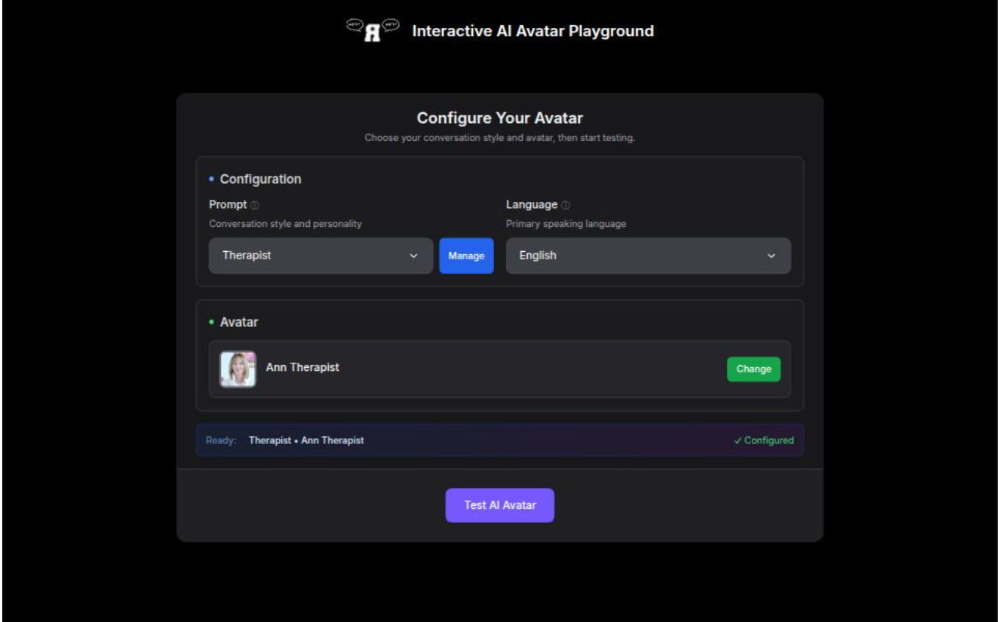

# Rivalista Interactive Avatar NextJS Demo

This is a sample project and was bootstrapped using [NextJS](https://nextjs.org/).

### Starting sessions

NOTE: Make sure you have enter your token into the `.env` file and run `npm run dev`.

To start your 'session' with a Interactive Avatar, first click the 'start' button. 

If you want to see a different Avatar, try a different voice, or switch Knowledge Bases, you can close the session and change the settings in the configuration panel, then 'start' the session again.

### Knowledge Base Selection

The application now supports multiple Knowledge Bases for different conversation experiences:

- **Trashtalking Therapist** - A sassy therapeutic assistant that provides helpful advice with attitude
- **Trash Talking Santa** - A festive Santa with a mischievous personality and playful banter

You can switch between these Knowledge Bases using the dropdown selector in the configuration panel.

